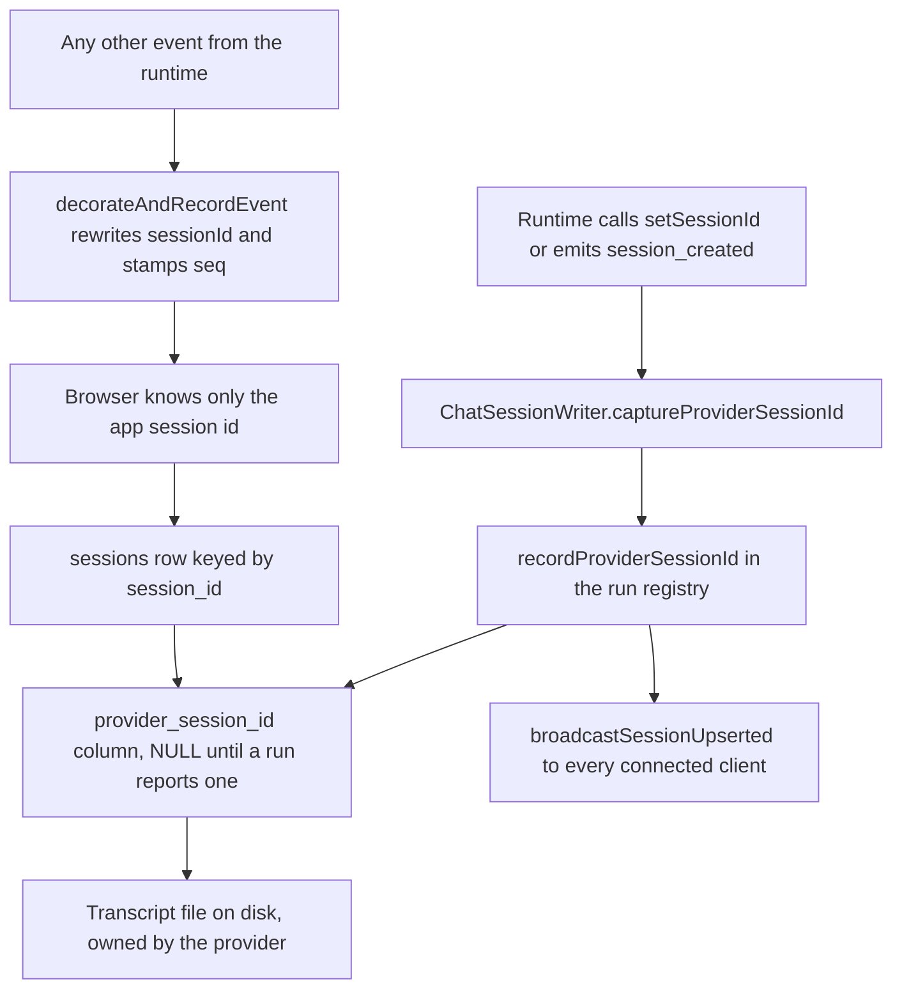
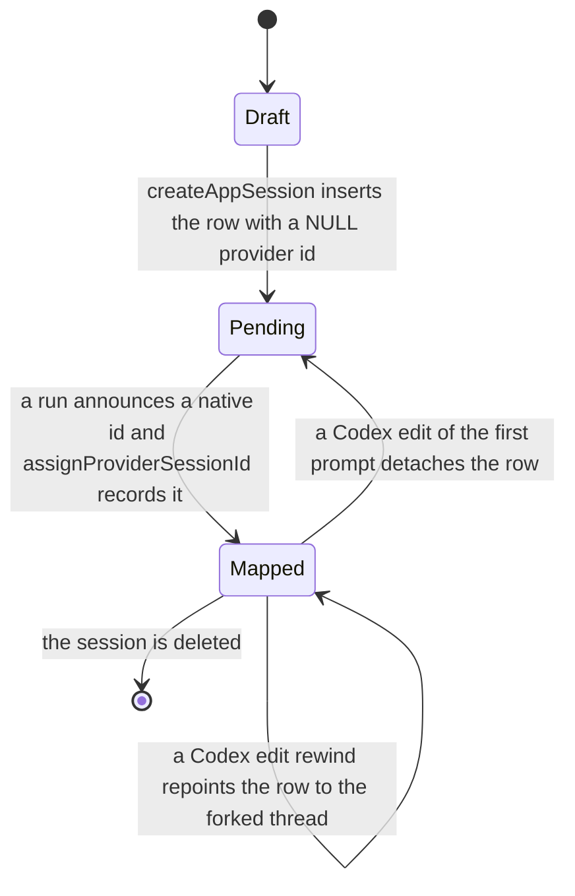
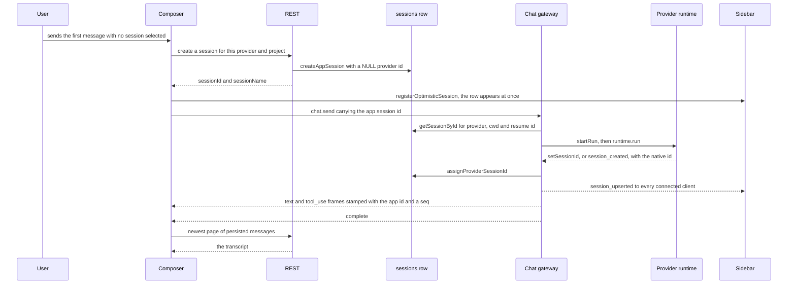
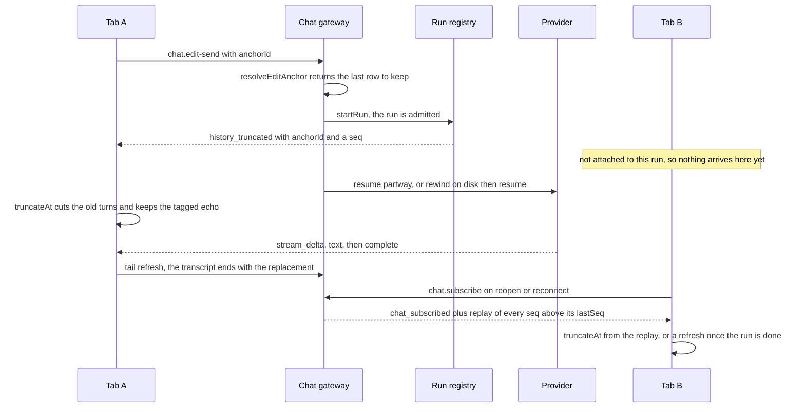

# Conversation handoff and session identity

## In one paragraph

A conversation has two identities. The **app session id** is a `randomUUID()` the server
mints over REST before the first websocket frame is sent; the URL, the message store and
every wire frame use it, and it never changes. The **provider session id** is the CLI's or
SDK's own id for the same conversation — a Claude transcript uuid, a Codex thread id — and
it is a server-side mapping detail stored in a nullable column on the same database row.
So "the handoff" is not about ids at all. It is about ownership, and a conversation changes
hands in four places: a draft becomes a persisted row, a live run's frames become a
transcript on disk, the filesystem watcher's provisional sidebar row is merged into the app
row, and an edit moves the conversation onto a different provider transcript. The transport
underneath is [the websocket layer](./01-websocket-transport.md); how frames become
rendered messages is [the realtime stream](./02-realtime-stream.md).

## Mental model

1. **The app session id exists before the first frame and never changes.**
   `sessionsService.createAppSession` mints it inside `POST /api/providers/sessions`, and
   the composer will not send until it has one. Predict from this: no code re-keys a
   message, migrates a store slot, or navigates mid-run.
2. **A provider id never reaches the browser on a chat frame.**
   `chatRunRegistry.decorateAndRecordEvent` overwrites `sessionId` (and `actualSessionId`
   on `complete`) with the app id on every outbound event. Exactly two paths leak it on
   purpose: the `session_upserted` delta carries `providerSessionId` so the sidebar can
   collapse an aliased row, and `GET /api/providers/sessions/:id/provider-id` serves the
   sidebar's "copy session id" action.
3. **`session_created` is swallowed server-side.** `ChatSessionWriter.send` intercepts it,
   records the mapping and returns before the event is ever sequenced. It is a valid
   `MessageKind` and all four runtimes emit it — Claude only when there was nothing to
   resume — but no client has ever received one.
4. **A run is keyed by the app session id, at most one at a time, and its audience is a
   set of sockets that may be empty.** `chatRunRegistry.startRun` returns `null` when the
   session is already running, which becomes `RUN_IN_PROGRESS`. The audience is the socket
   that sent `chat.send` plus every socket that sent `chat.subscribe` *while that run was
   running*. `runDetachedChatTurn` starts a run with no socket at all.
5. **The persisted transcript wins; live rows are an overlay.** Every `complete` for the
   viewed session schedules a bounded REST tail refresh, and the overlay is pruned against
   whatever comes back. Predict from this: any live row that is also on disk disappears
   within one refresh, and any row that is not on disk yet survives.
6. **Switching sessions moves a pointer.** Per-session state lives in `useSessionStore`
   slots keyed by session id. `setActiveSession` only changes which slot re-renders, so a
   background run keeps filling its own slot and nothing is unsubscribed.
7. **Nothing is ever deleted from a provider transcript.** An edit either resumes the
   transcript partway (Claude) or branches it on disk (Codex). An abandoned Codex thread
   stays on disk and is recorded in `superseded_provider_sessions` so the indexer will not
   offer it back.
8. **`history_truncated` only cuts, and only where the anchor is already loaded.**
   `sessionStore.truncateAt` returns without doing anything when no cached server row
   carries that `transcriptAnchorId`, so a client that has not paged back far enough is
   corrected by the REST refresh instead.

## The pieces

| File | Role |
| --- | --- |
| `server/modules/providers/provider.routes.ts` | `POST /sessions` mints the app id; `GET /sessions/:id/messages`, `/sessions/:id/provider-id`, `/sessions/running`, `POST /sessions/:id/fork` |
| `server/modules/providers/services/sessions.service.ts` | `createAppSession`, `resolveProviderSessionId`, `resolveEditAnchor`, `providerRewindsForEdit`, `rewindSessionForEdit`, `forkSessionById`, `fetchHistory`, `listRunningSessions` |
| `server/modules/database/repositories/sessions.db.ts` | The one row that holds both ids, and every mutation of the mapping |
| `server/modules/websocket/services/chat-session-writer.service.ts` | `ChatSessionWriter`: swallows `session_created`, captures the native id, fans out to every attached socket |
| `server/modules/websocket/services/chat-run-registry.service.ts` | `startRun`, `attachConnection`, `replayEvents`, `completeRun`, `completeRunIfCurrent`; internally `decorateAndRecordEvent` and `recordProviderSessionId` |
| `server/modules/websocket/services/chat-websocket.service.ts` | `handleChatSend`, `handleChatEditSend`, `handleChatSubscribe`, `handleChatAbort`, `dispatchRun`, `runDetachedChatTurn` |
| `server/modules/websocket/services/session-upsert-broadcast.service.ts` | `buildSessionUpsertedEvent` — the single builder of the sidebar delta |
| `server/modules/providers/services/sessions-watcher.service.ts` | Watches provider directories, debounces, broadcasts upserts in batches |
| `server/modules/providers/services/session-synchronizer.service.ts` | Shared full scan, per-file indexing, `pruneOrphanedSessions` |
| `server/modules/providers/list/claude/claude-sessions.provider.ts` | `resolveEditAnchor` — walks `parentUuid` back to the previous assistant row |
| `server/modules/providers/list/codex/codex-sessions.provider.ts` | `resolveEditAnchor` and `rewindSession` — forks the thread and repoints the session row |
| `server/modules/providers/list/claude/claude-fork.provider.ts`, `.../codex/codex-fork.provider.ts` | Branch a conversation into an independent one |
| `src/modules/chat/hooks/useChatComposerState.ts` | Allocates the session on the first send; builds `chat.send` and `chat.edit-send` |
| `src/modules/chat/ChatInterface.tsx` | `handleSessionEstablished`, `handleWebSocketReconnect`, `handleForkFromMessage`, `lastSeqRef`, `statusCheckSentAtRef` |
| `src/modules/chat/hooks/useChatSessionState.ts` | Subscribe-on-open, load-on-switch, the refresh coordinator, the New Session reset |
| `src/modules/chat/hooks/useChatRealtimeHandlers.ts` | Routes frames into the store and the busy map |
| `src/modules/chat/hooks/useSessionStore.ts` | Per-session slots, `appendRealtime`, `truncateAt`, `refreshLatestFromServer` |
| `src/modules/chat/utils/sessionMessageReconciliation.ts` | `removeOptimisticUserEchoes` — retires local echoes against persisted rows |
| `src/modules/chat/utils/messageHistoryRefreshCoordinator.ts` | Coalesces refresh signals; keeps hidden sessions dirty |
| `src/modules/chat/utils/messageKeys.ts` | `getIntrinsicMessageKey` — stable React keys across re-fetches |
| `src/shared/context/SessionProtectionContext.tsx`, `src/shared/hooks/useSessionProtection.ts` | The busy map: which sessions are producing a response |
| `src/modules/project-workspace/hooks/useProjectsState.ts` | `registerOptimisticSession`, `upsertSessionIntoProject`, `handleNewSession` |

## The two ids and where they meet

**RULE: one row owns both ids. The app id is the key; the provider id is a nullable column
on it.**

| | App session id | Provider session id |
| --- | --- | --- |
| Minted by | `sessionsService.createAppSession` with `randomUUID()` | The provider CLI or SDK, mid-run |
| When | Before the first `chat.send` | The first time the runtime announces one |
| Column | `sessions.session_id` | `sessions.provider_session_id`, NULL until then |
| In the URL, the store, the frames | Yes | Never |
| Used to | Address runs, slots, permissions, aborts | Resume the provider, find the transcript on disk |

Two capture paths exist because runtimes differ. All four runtimes call
`writer.setSessionId(...)` the moment they read an id off their stream; Claude additionally
emits `session_created`, but only when there was nothing to resume. Both land in
`ChatSessionWriter.captureProviderSessionId`, which forwards to the registry's
`recordProviderSessionId`.

**Capture is not "first one wins".** Repeating the id already held is a no-op in both
functions. A *different* id replaces the mapping, and that is deliberate: a Claude edit of
the very first prompt runs with `resumeFromScratch`, the SDK announces a brand-new native
id, and the row has to follow it.

Reading in the other direction, runtimes receive the **app** id and translate it themselves.
`provider-runtime.service.ts` injects `context.resolveProviderSessionId`, which is
`sessionsService.resolveProviderSessionId`:

- a row with a mapping returns its `provider_session_id`;
- a row without one returns `null`, which every runtime reads as "start fresh";
- an id with no row at all is returned unchanged, on the assumption that a direct API caller
  passed a provider-native id the watcher has not indexed yet.

### What `session_created` used to do

It used to be the handoff. The frontend held a placeholder id, sent the first message, and
re-keyed everything when the provider announced its real id. Commit `f5eac2ec` ("unify
session gateway with stable IDs and a single WS protocol") deleted that: *"The frontend
previously juggled placeholder IDs, provider-native IDs, and session_created handoffs, which
caused race conditions and provider-specific branching."* What survives is the swallow in
`ChatSessionWriter.send` and a no-op `case 'session_created'` in `normalizedToChatMessages`
(`src/modules/chat/hooks/useChatMessages.ts`), kept because the kind is still in the union.

### The provider id column's lifecycle

`Draft` is a UI state only — no row exists yet. In `Pending`,
`GET /api/providers/sessions/:id/messages` returns an empty page by design, because
`sessionsService.fetchHistory` short-circuits on a NULL `provider_session_id`. So during the
very first turn the transcript on screen is entirely realtime rows.

Only a provider that rewinds by branching reaches `Pending` again:
`CodexSessionsProvider.rewindSession` calls `markProviderSessionSuperseded` and then
`detachProviderSession` when nothing survives the cut. Claude never detaches — it re-runs
with `resumeFromScratch` and the row is remapped when the SDK announces its new id.

## Starting a new conversation

**RULE: the id is allocated over REST before the first frame, so the sidebar row, the URL
and the run agree from message one.**

Three details worth pinning:

- **The name.** `buildCloudCliSessionName(initialMessage)` derives a four-word title from
  the first message, so the sidebar row is never blank. The composer keeps its own summary
  and uses it if the server returns an empty string.
- **The optimistic row.** `registerOptimisticSession` builds a local `SessionUpsertedEvent`
  and runs it through `upsertSessionIntoProject`, the same reducer the wire event uses. It
  deliberately carries no `providerSessionId` — there is nothing truthful to put there yet.
- **The real row.** The first *server* `session_upserted` arrives mid-run, from
  `recordProviderSessionId`. The reducer matches it to the optimistic row by alias id,
  updates in place, and refuses to blank a title it already has.

Navigation happens once. `ChatInterface.handleSessionEstablished` sets `currentSessionId`,
calls `onSessionEstablished` (which registers the optimistic row) and then
`onNavigateToSession`, which is `ProjectMainRegion.handleNavigateToSession` doing
`navigate('/session/:id')`. The only other navigate in this area is the alias fix-up
described under [transcripts on disk](#transcripts-on-disk), and it fires only when the URL
holds a provider-native id.

## Switching sessions in the UI

**RULE: a switch changes a pointer. It clears no slot and unsubscribes from nothing.**

| On switching to session B | What happens |
| --- | --- |
| `useSessionStore` | `setActiveSession(B)` moves `activeSessionIdRef`. A's slot stays in the map with its `serverMessages`, `realtimeMessages` and pagination |
| Re-render | `notify(sessionId)` bumps the tick only when the written session is the active one, so A's background frames cost no renders |
| Live subscription | The `chat.subscribe` effect in `useChatSessionState.ts` fires for B with B's `lastSeq`. A is never unsubscribed — there is no `chat.unsubscribe` frame, and the only server-side audience state is each run's connection set |
| History | If B's slot has a `fetchedAt` and the session key matches, nothing is refetched; only `isStale` (`STALE_THRESHOLD_MS = 30_000`) may trigger a bounded tail refresh. Otherwise `fetchFromServer` loads the newest `SESSION_MESSAGES_PAGE_SIZE = 20` rows |
| Scroll and pagination | Reset in the same load effect and by the scroll effects; see [scrolling](./05-scrolling.md) |
| Streaming buffer | `resetStreamingState()` clears `streamTimerRef` and `accumulatedStreamRef`. These are per-`ChatInterface`, not per-slot |

A background run therefore keeps accumulating. Frames for A arrive on the same socket,
`useChatRealtimeHandlers` reads `msg.sessionId`, and `sessionStore.appendRealtime(A, msg)`
writes into A's slot, capped at `MAX_REALTIME_MESSAGES = 500`. Switching back renders what
was collected. The store lives as long as `ChatInterface` is mounted, which is the whole
time a project is selected: `WorkspaceMain` hides the chat tab with a `hidden` class instead
of unmounting it.

"New Session" is not a switch. `handleNewSession` selects the project, clears
`selectedSession`, navigates to `/` and increments `newSessionTrigger`, which drives a
dedicated reset effect in `useChatSessionState.ts`. The counter exists because the click
must still do something when the app is already in that exact visible state.

## Session protection: the busy map

**RULE: `useSessionProtection` answers one question — which sessions are producing a
response right now.** It no longer protects list refreshes.

The name is historical. It used to suppress project-list refreshes during a run, because the
server pushed whole-project snapshots that could clobber the view. That is gone: the backend
pushes per-session `session_upserted` deltas, and both producers say so in comments —
*"an upsert of one session can never clobber unrelated client state, so the frontend needs no
'suppress updates while a run is active' protection logic"* (`sessions-watcher.service.ts`)
and *"no 'suppress updates while a run is active' protection is needed anymore"*
(`useProjectsState.ts`).

What remains is a `Map<sessionId, SessionActivity>` of `{ statusText, canInterrupt, startedAt }`:

| Written by | When |
| --- | --- |
| `markSessionProcessing` | The composer, just before `chat.send`; a `chat_subscribed` ack with `isProcessing: true`; a `status` frame carrying text; a `permission_request` |
| `markSessionIdle` | `complete`; `protocol_error`; a `chat_subscribed` ack with `isProcessing: false` |
| `syncProcessingSessions` | Every 5 s from `GET /api/providers/sessions/running`, which returns `chatRunRegistry.listRunningRuns()` |

Two guards make it stable:

- **Stale idle acks.** `markSessionIdle(id, { ifStartedBefore })` keeps an entry whose
  `startedAt` is at or after the moment that session's `chat.subscribe` was sent
  (`statusCheckSentAtRef`). Without it, an ack describing the previous state clears a send
  that started while the subscribe was in flight.
- **A 10 s local grace.** `syncProcessingSessions` keeps entries the server did not report
  if they are younger than `LOCAL_ACTIVITY_GRACE_MS = 10_000`, so the poll cannot race a
  send that has not reached the registry yet.

Consumers: `useProcessingSessions` (chat — the activity line and the abort button),
`useBusySessionIdSet` (sidebar — membership only, derived from a sorted membership key so
its `Set` identity survives the several-times-a-second `statusText` rewrites; pinned by
`src/shared/tests/busySessionIds.test.tsx`), and `isSessionProcessing` (`useProjectsState`,
to decide whether a `session_upserted` for the viewed session should force a reload).

## Reconciling live events with the persisted transcript

**RULE: live rows are provisional. Persisted rows win, and every terminal event schedules a
bounded re-read.**

A slot holds `serverMessages` (REST) and `realtimeMessages` (socket) separately and derives
`merged` from both, recomputing only when either array changes by reference
(`recomputeMergedIfNeeded`). Three mechanisms decide what survives, and a fourth decides what
React sees:

| Layer | Where | Key |
| --- | --- | --- |
| The same row from both sources | `computeMerged`, `pruneRealtimeSupersededByServer` (`useSessionStore.ts`) | `NormalizedMessage.id`, plus `toolId` for tool calls and same-turn text matching for assistant replies |
| The user's optimistic echo | `removeOptimisticUserEchoes` (`sessionMessageReconciliation.ts`) | An id starting with `local_`, then trimmed text plus image and file counts, within 5 min (30 s when there is no text) and no more than 10 s before the local timestamp, one-to-one against unclaimed server rows |
| Assistant text echoed twice | `dedupeAdjacentAssistantEchoes` (`useSessionStore.ts`) | Adjacent assistant rows with identical trimmed content; a `stream_delta` placeholder collapses into the persisted `text` row |
| React keys | `getIntrinsicMessageKey` (`messageKeys.ts`), disambiguated by `messageKeyMap` in `ChatMessagesPane.tsx` | First of `id`, `messageId`, `toolId`, `toolCallId`, `blobId`, `rowid`, `sequence`; otherwise `type` plus timestamp plus `toolName` plus the first 48 characters, then suffixed by occurrence index on collision |

`getIntrinsicMessageKey` is a *render* key, not a store key. A refresh replaces source
objects with equivalent new ones, so object identity is not durable across pagination or
hydration.

The refresh is coordinated, never fired directly:

- `useChatRealtimeHandlers` calls `requestLatestMessages(sid, isActive)` on `complete`, and
  only when `sid` is the viewed session.
- `ChatInterface.handleWebSocketReconnect` awaits `requestLatestMessages` **before**
  re-sending `chat.subscribe`, so replay lands on top of a fresh transcript.
- `useProjectsState` bumps `externalMessageUpdate` when a `session_upserted` names the viewed
  session and it is *not* processing. That is the "changed on disk from somewhere else"
  signal, and the effect that consumes it also skips while the session is processing.

All three go through `createMessageHistoryRefreshCoordinator`: one in-flight request per
session, at most one trailing request, and a session that cannot refresh right now (chat tab
hidden, or no longer the viewed session) stays marked dirty until `flushPending` runs on
activation. The fetch itself is `refreshLatestSlotFromServer`, which pulls the newest 20 rows
and stitches them onto the cached suffix, bridging with extra requests for turns bigger than
one page. See [the message store](./04-message-store-and-lazy-loading.md).

## Editing an already-sent message

**RULE: an edit is a new run plus a broadcast instruction to forget rows — never a delete.**

`chat.edit-send` is its own frame so `chat.send` keeps its "the client cannot influence the
shape of the conversation" property, and so the edit gets its own refusals:
`ANCHOR_REQUIRED`, `ANCHOR_NOT_FOUND`, `ANCHOR_LOOKUP_FAILED`, `EDIT_NOT_SUPPORTED`,
`EDIT_REWIND_FAILED`. The anchor is the row's `transcriptAnchorId` — the provider's own row
id, today Claude's message uuid and Codex's enclosing turn id.

`handleChatEditSend` resolves the anchor to `resumeThroughId`, the last row to **keep**;
`null` means the edited message was the first prompt. Then it branches on
`sessionsService.providerRewindsForEdit`, which is simply whether that provider implements
`rewindSession`:

| Provider shape | Chosen because | What the run receives |
| --- | --- | --- |
| Resume partway (Claude) | The SDK has `resumeSessionAt` | `resumeAnchorId` and `resumeFromScratch` run options; nothing on disk is rewritten |
| Rewind first (Codex) | A thread only grows; `thread/fork` is the only cut | No extra options. The row is repointed to the forked thread, then run as an ordinary resume |

Both paths emit `history_truncated` through `run.writer` *before* the rewind, inside
`dispatchRun`'s `beforeRun` hook. That hook runs only after `startRun` admitted the run, so
a send that will be refused with `RUN_IN_PROGRESS` can never rewind anything. The kind is a
normal `MessageKind`, so the frame is sequenced and buffered like any provider event even
though the gateway, not a provider, produced it.

On the client, `sessionStore.truncateAt(sessionId, anchorId)`:

1. Finds the cached server row whose `transcriptAnchorId` matches, and returns untouched if
   there is none.
2. Drops that row and everything after it.
3. Clears `realtimeMessages` — except the newest row tagged `replacesAnchorId === anchorId`,
   which is the optimistic echo of the message the user just sent.
4. Stamps that survivor with `replacesAfterRowCount = cutIndex`.
5. Resets `total` and `offset` to the surviving length, so the pager cannot request pages
   that no longer exist.

`replacesAfterRowCount` then feeds two things: `removeOptimisticUserEchoes`, which only lets
server rows at or after that index retire the echo, and `readSortTime`, which floors a
`replacesAnchorId` row at the newest server timestamp so it stays last.

Tests that pin this: `server/modules/websocket/tests/chat-edit-send.test.ts` ("an edit
resumes through the turn before the one being replaced", "editing the first prompt starts the
conversation over", "every subscribed client is told to drop the superseded turns", "a
refused send never rewinds the conversation", "a provider that has to branch to rewind is
rewound before the run, not during it") and
`src/modules/chat/tests/sessionStoreTruncate.test.tsx` ("keeps the replacement the cut was
made for", "keeps the replacement last when the kept history comes back re-stamped", "keeps
only the newest replacement when an earlier attempt was refused").

## Multi-tab and multi-client

**RULE: a socket is in a run's audience only if it started the run or subscribed while the
run was running.**

`ChatSessionWriter` holds a `Set` of connections and forwards to all of them, deleting any it
finds closed during `forward()`. `chatRunRegistry.attachConnection` calls the writer's
`updateWebSocket`, which *adds* rather than replaces — the method keeps that name only so the
gateway writer stays a drop-in for `WebSocketWriter`, whose version does replace.
`handleChatSubscribe` calls it only when the run is still running.

| Tab B's situation when tab A sends | What tab B observes |
| --- | --- |
| Had the session open, subscribed before the run started | No live frames. The busy dot appears within 5 s from the running-sessions poll. The transcript catches up after the run, when a `session_upserted` for an idle session bumps `externalMessageUpdate` |
| Opens or refreshes the session mid-run | `chat.subscribe` attaches it, `chat_subscribed.isProcessing` is true, replay delivers every `seq > lastSeq`, and everything after that is live |
| Socket drops and reconnects mid-run | Tail refresh first, then subscribe: attach plus replay |
| Was the tab that got refreshed | Its abandoned socket is dropped from the set on the next `forward()` |

Replay is not loss-free, and the code does not pretend it is. `seq` restarts at 1 for each
run, but the client's `lastSeqRef` is a per-session high-water mark that is never reset. A
client that saw run 1 reach seq 40 and subscribes during run 2 replays nothing for run 2's
first 40 events. It self-heals because both subscribe paths are paired with a REST refresh:
on reconnect before subscribing, on `complete` after. Completed runs are deliberately never
replayed even though they stay buffered for `COMPLETED_RUN_RETENTION_MS` (5 minutes) — after
a reload `lastSeq` is 0, and replaying them would duplicate what the history fetch just
returned. The buffer is also capped at `MAX_BUFFERED_EVENTS_PER_RUN` (5000), oldest first,
with the same REST refresh as the fallback.

## Transcripts on disk

**RULE: the watcher discovers conversations independently of the app, and its rows are keyed
by the provider id until the app claims them.**

`sessions-watcher.service.ts` watches four provider directories with chokidar in polling mode
(`usePolling`, a 6 s interval, `depth: 6`, `ignoreInitial`), keeps only `*.jsonl` files —
`opencode.db` for OpenCode — and calls `sessionSynchronizerService.synchronizeProviderFile`.
Indexed ids are queued and flushed with a 500 ms debounce and a 2 s maximum wait
(`PROJECTS_UPDATE_DEBOUNCE_MS`, `PROJECTS_UPDATE_MAX_WAIT_MS`), then handed to
`broadcastSessionUpsertedBatch`, which walks the client set once for the whole batch.

How rows are claimed:

- A session created outside the app gets a row where `session_id === provider_session_id`
  (`sessionsDb.createSession`).
- A session created *by* the app is looked up by `provider_session_id` on re-index, so the
  app's row is updated in place instead of being duplicated.
- When the race is lost anyway, `assignProviderSessionId` merges inside one transaction: it
  deletes the watcher's duplicate row and fills in `jsonl_path` and `custom_name` from it
  wherever the app row has none. The sidebar can never observe both rows.
- OpenCode avoids the race up front: its synchronizer falls back to
  `findLatestPendingAppSession` to claim the newest app row for that project still missing a
  provider id.

`session-synchronizer.service.ts` adds two guarantees beyond indexing. Concurrent callers
share one scan (opening the UI fires `/api/projects` and `/api/projects/archived` at once),
and `pruneOrphanedSessions` deletes rows whose transcript is gone — but only when the
containing directory still exists, so an unmounted home cannot wipe the index, and only when
no provider sync failed in that pass.

The sidebar's `session_upserted` reducer in `useProjectsState.ts` then does five things:

1. Matches an existing row by alias id (`sessionId`, `providerSessionId`, `session.id`) and
   drops any other row sharing an alias, so a merged conversation collapses to one entry.
2. Refuses to blank a summary it already has.
3. Creates the project entry from the delta's `project` payload when the client has never
   seen that project.
4. Bumps `externalMessageUpdate` when the delta names the viewed session and that session is
   not processing; otherwise marks the row for attention.
5. Navigates to `/session/:appId` when the URL still holds the provider-native alias.

## Forking and resuming

**RULE: a fork is a new app session id over a copied provider transcript. The source is never
touched.**

`sessionsService.forkSessionById` requires the source to have both a `provider_session_id`
and a `jsonl_path` — a session that never ran has nothing to copy — delegates to the
provider's fork adapter, then writes the new row with `sessionsDb.createForkedSession`. That
insert records `provider_session_id`, `jsonl_path` and `forked_from_session_id` immediately,
and first deletes any row the watcher already made for the new file. The source's `model` and
`effort` are copied, because a fork that silently dropped to the catalog default would answer
differently from the conversation it branched from. Finally it broadcasts `session_upserted`,
which is why neither caller — `ChatInterface.handleForkFromMessage` and the sidebar's
`forkSession` — refetches anything before navigating.

| | `claude-fork.provider.ts` | `codex-fork.provider.ts` |
| --- | --- | --- |
| Mechanism | SDK `forkSession`, which remaps every uuid and rewrites the `parentUuid` chain | JSON-RPC `thread/fork` on `codex app-server`, writing a rollout with a `forked_from_id` |
| Cut granularity | A row — `upToMessageId` can stop at the prompt itself | A turn — forking from a message keeps the answer it got |
| Where the copy lands | Beside the source transcript | Today's date directory, at the path the server reports |
| Verification | `stat`s the file before a row claims it exists | Trusts the path the server already confirmed |
| Title | Passed to the SDK | Not forwarded; the name lives in this app's row |

Resuming needs no special path. Opening an old session and sending is an ordinary
`chat.send`: the gateway reads provider, `cwd` and `provider_session_id` from the row, the
runtime resolves the native id through `resolveProviderSessionId`, and the SDK resumes. A
`null` there means "start a new provider session", which is the same code path a brand-new
conversation takes.

## Gotchas and why the code looks like this

| The odd thing | Why |
| --- | --- |
| `session_created` is a valid kind no client ever receives | It used to drive the id handoff. `f5eac2ec` replaced placeholder ids with an app-allocated id; runtimes still emit the event, so it survives purely as the mapping trigger |
| No `PENDING_SESSION_ID` anywhere | The busy map used to key an in-flight first message under a placeholder and migrate it on `session_created`. Ids are concrete before the first send now, so the placeholder was deleted |
| "Session protection" protects nothing anymore | Sidebar updates became per-session deltas; a keyed upsert cannot clobber unrelated state, so the suppression it existed for was removed and only the busy map remains |
| `history_truncated` goes out *before* the rewind | A Codex rewind spawns `codex app-server` and waits on a JSON-RPC handshake — close to a second with the just-edited message still on screen. A failed rewind still ends the run, and the terminal `complete` makes every client re-read the transcript (`bf14f8f2`) |
| The optimistic echo carries `replacesAnchorId` | Otherwise `truncateAt` deletes the message the user just sent, and it only reappears when the run finishes (`a75841de`) |
| …and `replacesAfterRowCount` | A Codex fork re-stamps every surviving turn with the time of the copy, so an *earlier* turn saying the same thing ("yes", "continue", the typo being corrected) landed inside the echo's dedupe window and claimed it (`724f43c5`) |
| `truncateAt` keeps only the *newest* tagged replacement | A refused send leaves its echo behind; a retried edit would otherwise show both attempts |
| The rewind runs inside `dispatchRun`'s `beforeRun` | It used to run before the run was admitted, so an edit refused with `RUN_IN_PROGRESS` had already moved the conversation onto a branch without telling the client |
| `repointSessionToProviderSession` exists next to `assignProviderSessionId` | `assign` keeps the existing `jsonl_path` on purpose; reusing it for a rewind left the session claiming the new thread while still reading the old transcript |
| `superseded_provider_sessions` | The pre-edit Codex rollout stays on disk but is nobody's conversation. Without the record a rescan hands it back — and for a disk-discovered session, whose app id *is* its thread id, that reinstates the version the user edited away. It also lets "delete permanently" reach transcripts the row no longer points at |
| `completeRunIfCurrent` vs `completeRun` | A queued message can start the session's next run before the previous runtime promise settles; the session-keyed helper would then kill the *new* run. `dispatchRun`'s `finally` uses the run-scoped one |
| `updateWebSocket` adds instead of replacing | It used to replace, so opening a session in a second tab froze the first mid-answer (`48c8f647`) |
| Dead sockets are collected in `forward()`, not on close | A refreshed tab leaves its old connection behind; sweeping on send is enough and costs nothing extra |
| The sidebar refuses an empty summary in an upsert | A fresh session momentarily broadcasts a blank `custom_name` before the indexer fills it in, which flashed the row back to the placeholder title |
| History is empty for a session that has never run | `fetchHistory` short-circuits on a NULL `provider_session_id`, so during the very first turn the transcript you see is entirely realtime rows |
| A run can exist with no sockets at all | `runDetachedChatTurn` fires from a timer for scheduled messages. Everything still flows through the registry, so whoever opens the session mid-run replays it from seq 1 |

## If you change this, check that

| If you touch | Also check |
| --- | --- |
| `ChatSessionWriter.send` | `chat-run-registry.test.ts` ("session_created is swallowed and persisted as the provider-id mapping"), and that no frame can escape without `sessionId` remapped and a `seq` |
| `decorateAndRecordEvent` | The exactly-one-`complete` contract, `replayEvents` ordering, and `MAX_BUFFERED_EVENTS_PER_RUN` truncation |
| `captureProviderSessionId` or `recordProviderSessionId` | That a *different* announced id still remaps the row — Claude's `resumeFromScratch` path depends on it |
| `sessionsDb.assignProviderSessionId` | `sessions-provider-mapping.test.ts`, plus `repointSessionToProviderSession` and `detachProviderSession`, which must stay distinct |
| `handleChatSubscribe` | The client's `lastSeqRef` semantics, the "completed runs are not replayed" rule, and the reconnect ordering in `ChatInterface.handleWebSocketReconnect` |
| `truncateAt` | `removeOptimisticUserEchoes` (`replacesAfterRowCount`), `readSortTime` (`replacesAnchorId`), and `sessionStoreTruncate.test.tsx` |
| `handleChatEditSend` | Both provider shapes — `resolveEditAnchor` for Claude, `rewindSession` for Codex — and that a refused run never rewinds |
| `session-upsert-broadcast.service.ts` | The sidebar reducer's alias dedupe and empty-summary guard in `useProjectsState.ts`. It is the only builder; keep it that way |
| The busy map's shape | `useBusySessionIdSet`'s membership-key memo (sidebar re-render cost), `busySessionIds.test.tsx`, and the 5 s running-sessions reconciliation |
| `useSessionStore` slot fields | [the message store doc](./04-message-store-and-lazy-loading.md), `recomputeMergedIfNeeded`'s reference-equality cache, and the pagination helpers |
| Anything that would make a session id mutable | Nothing should need this. A mutable id breaks slots, `lastSeqRef`, the busy map, the run registry key and the URL at once |
