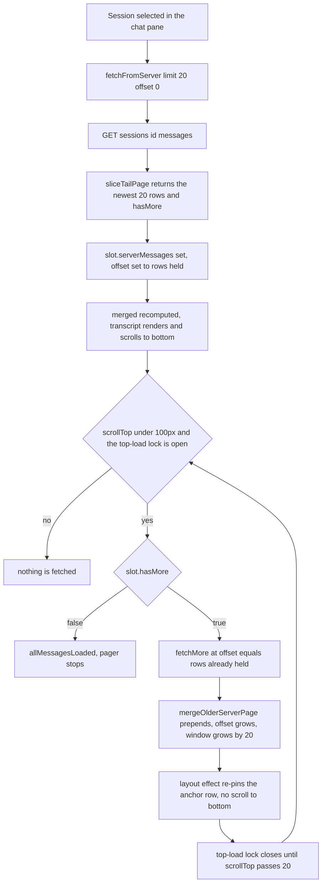
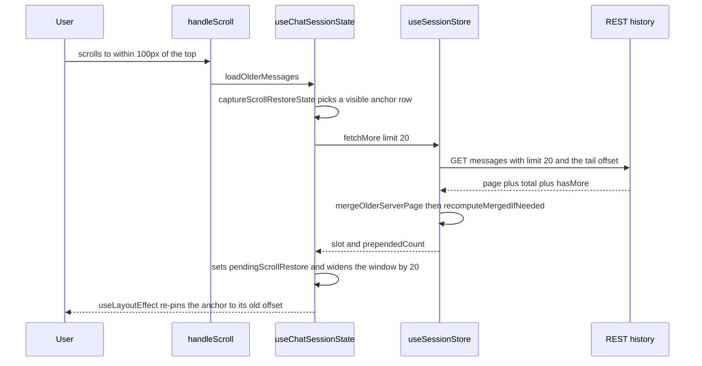
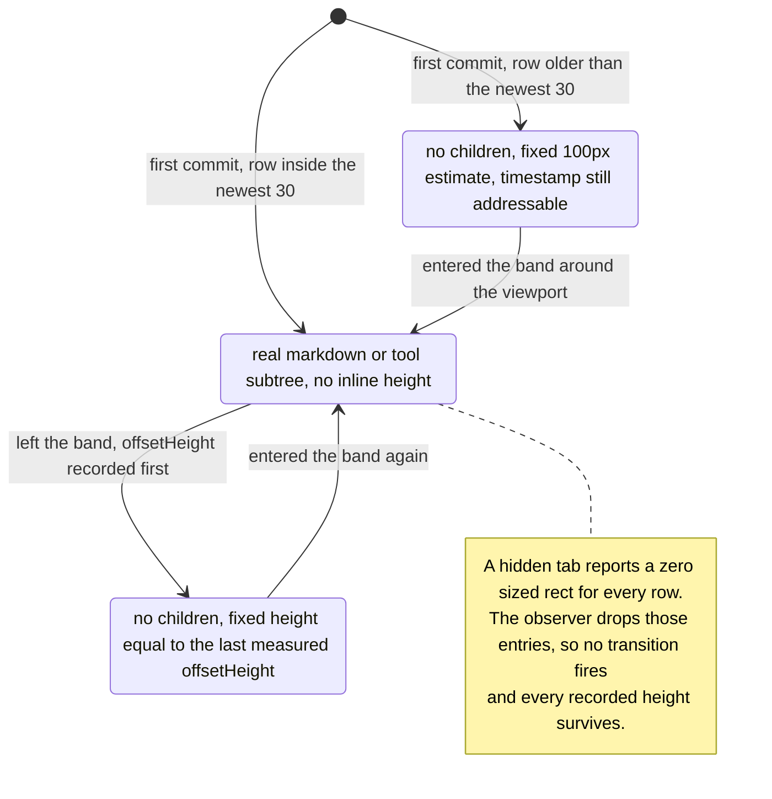

# The message store and lazy loading

## In one paragraph

Every transcript this tab has opened lives in one `Map<sessionId, SessionSlot>` inside
`useSessionStore` — a single instance, created by `ChatInterface` and alive for as long as the
workspace is. A slot holds two arrays — `serverMessages` (what REST returned) and
`realtimeMessages` (what the socket delivered since) — plus a cached `merged` array that is
what actually renders. History is paginated from the *newest* row backwards: opening a session
fetches the last 20 rows, scrolling up prepends 20 more. On the server those pages are sliced
out of a full-transcript cache keyed by the transcript file's `stat`, so a multi-megabyte
JSONL is parsed once, not once per page. On the client every rendered row is wrapped in a
`LazyMessageRow` that keeps a fixed-height placeholder in the DOM and mounts its expensive
markdown/tool subtree only inside a band around the viewport. That last part is why "Load all"
on a 29k-row session costs ~112 MB instead of ~1 GB.

## Mental model

1. **The store is a ref, not React state.** `storeRef` is a plain `Map` mutated in place.
   Re-renders happen only because `notify(sessionId)` bumps a counter — and only when
   `sessionId` matches `activeSessionIdRef`. A background session can absorb a thousand
   frames without rendering anything.
2. **`merged` is derived, cached, and invalidated by reference.** `recomputeMergedIfNeeded`
   compares `serverMessages`/`realtimeMessages` against `_lastServerRef`/`_lastRealtimeRef`.
   Every mutator therefore replaces arrays instead of mutating them; a `push` would silently
   skip the recompute.
3. **Pagination counts backwards from the end.** `offset: 0` is the newest page. `offset: N`
   means "the page ending N rows before the end". `hasMore` means *older* rows exist. Both
   `sliceTailPage` on the server and every helper in `sessionMessagePagination.ts` obey this.
4. **`slot.offset` is "how many persisted rows I hold", not "how far into the list I am".**
   After a successful page it equals `serverMessages.length`. `fetchFromServer` stores
   `requestedOffset + page.length`, and since every one of its call sites requests
   `offset: 0`, that is the same number. It is exactly the tail offset the next older page
   needs, which is why `fetchMore` requests `slot.offset` and nothing has to translate.
5. **Server history and live frames are different shapes of the same conversation.**
   `prepareTranscriptMessages` runs on REST reads only, so the transcript mid-run does not
   match the transcript after a refresh. Reconciliation, not equality, is the contract — see
   [the realtime stream](./02-realtime-stream.md).
6. **The render list is narrowed three times, and none of them is virtualization.**
   `visibleMessages` is a tail slice of `chatMessages` (100 rows by default); each surviving
   row mounts its content only near the viewport; and each *mounted* row still skips layout
   and paint off-screen via `content-visibility: auto`. Every row keeps a DOM node throughout.
7. **A row's wrapper element never unmounts.** It carries `data-message-timestamp` whenever
   the row has a timestamp, so a search jump can find and scroll to a row whose content is
   still a placeholder. Scroll *anchor restore* is different — it selects `.chat-message`,
   which lives inside the mounted content, so it can only ever anchor on a mounted row. That
   is safe: `captureScrollRestoreState` takes the first such row at or below the container's
   top edge, and rows at the viewport edge are inside the mounted band by definition.
8. **No message is persisted client-side.** No localStorage, no IndexedDB for transcripts
   (composer drafts, in `chatStorage.ts`, are the only chat state that touches localStorage).
   The provider's transcript file is the source of truth and a reload re-fetches the tail page.

## The pieces

| File | Role |
| --- | --- |
| `src/modules/chat/hooks/useSessionStore.ts` | The `Map<sessionId, SessionSlot>`, the merge, and every mutator. |
| `src/modules/chat/utils/sessionMessagePagination.ts` | Pure page-stitching helpers: overlap detection, bridge planning, prepend merge. |
| `src/modules/chat/utils/sessionMessageReconciliation.ts` | `removeOptimisticUserEchoes` — retires a locally-appended user row once its persisted copy arrives. |
| `src/modules/chat/hooks/useChatMessages.ts` | `normalizedToChatMessages` — `NormalizedMessage[]` to `ChatMessage[]`, with a `WeakMap` projection cache. |
| `src/modules/chat/hooks/useChatSessionState.ts` | The view layer: decides when to fetch, owns the render window, scroll restore and "load all". |
| `src/modules/chat/utils/messageHistoryRefreshCoordinator.ts` | Coalesces automatic tail refreshes; keeps hidden sessions dirty instead of fetching. |
| `src/modules/chat/utils/searchTargetLocator.ts` | `findSearchTargetIndex` and `resolveSearchWindowSize` — resolves a sidebar hit against the loaded list, then says how wide the window must be. |
| `src/modules/chat/transcript/ChatMessagesPane.tsx` | Renders `visibleMessages`, wraps each row in `LazyMessageRow`. |
| `src/modules/chat/transcript/LazyMessageRow.tsx` | Placeholder-or-content per row; remembers the height it last measured. |
| `src/modules/chat/hooks/useLazyRowObserver.ts` | One shared `IntersectionObserver` per pane, rooted at the scroll container. |
| `src/modules/chat/transcript/LoadAllMessagesOverlay.tsx` | The "Load all (N)" pill shown at the top of a partially-loaded transcript. |
| `src/modules/chat/transcript/ChatExportMenu.tsx` | Calls `onLoadFullTranscript` before building a file. |
| `server/modules/providers/provider.routes.ts` | `GET /api/providers/sessions/:sessionId/messages` — parses `limit`/`offset`. |
| `server/modules/providers/services/sessions.service.ts` | `fetchHistory` — cache lookup, tail slice, stamps the app session id on every row. |
| `server/modules/providers/services/session-history-cache.service.ts` | Full-transcript LRU validated by `stat`. |
| `server/shared/message-unification.ts` | `prepareTranscriptMessages` — reduces a Claude or Codex transcript to renderable rows before it is paged. |
| `server/shared/utils.ts` | `sliceTailPage` — the one definition of what a page is. |

## The numbers

Every tunable in this subsystem, with the file that owns it. Nothing here is configurable at
runtime.

| Constant | Value | Where | What it bounds |
| --- | --- | --- | --- |
| `SESSION_MESSAGES_PAGE_SIZE` | 20 | `src/modules/chat/utils/sessionMessagePagination.ts` | One history page: the session-open fetch, each scroll-up fetch, each tail refresh, each later bridge chunk, and the step the render window grows by on a prepend. |
| `INITIAL_VISIBLE_MESSAGES` | 100 | `src/modules/chat/hooks/useChatSessionState.ts` | The initial render window — a tail slice of the projected list. |
| `SEARCH_TARGET_CONTEXT_MESSAGES` | 20 | `src/modules/chat/hooks/useChatSessionState.ts` | Rows kept after a search hit when the window is widened to reach it. |
| `STALE_THRESHOLD_MS` | 30_000 | `src/modules/chat/hooks/useSessionStore.ts` | How old `fetchedAt` may get before re-activating a session refreshes it. |
| `SESSION_HISTORY_REQUEST_TIMEOUT_MS` | 30_000 | `src/modules/chat/hooks/useSessionStore.ts` | `AbortSignal.timeout` on every history request. Same number as the staleness threshold, different job. |
| `MAX_REALTIME_MESSAGES` | 500 | `src/modules/chat/hooks/useSessionStore.ts` | `realtimeMessages` per slot; the front is dropped. |
| `INITIAL_MOUNTED_TAIL_ROWS` | 30 | `src/modules/chat/transcript/ChatMessagesPane.tsx` | Newest rendered rows that mount content on the first commit. |
| `LAZY_ROW_VIEWPORT_MARGIN_PX` | 1200 | `src/modules/chat/hooks/useLazyRowObserver.ts` | How far outside the scroll container a row stays mounted. |
| `ESTIMATED_ROW_HEIGHT_PX` | 100 | `src/modules/chat/transcript/LazyMessageRow.tsx` | Placeholder height for a row that has never been measured. |
| `MAX_CACHED_TRANSCRIPT_FILE_BYTES` | 256 MB | `server/modules/providers/services/session-history-cache.service.ts` | Source-file bytes held by the server's full-transcript cache. |
| `MAX_CACHE_ENTRIES` | 8 | `server/modules/providers/services/session-history-cache.service.ts` | Sessions held by that cache. |

---

## The slot

**RULE: one slot per session, created on first touch, never removed.**

`createEmptySlot` in `src/modules/chat/hooks/useSessionStore.ts` builds it; `getSlot` creates
one lazily. A slot's arrays can be emptied — `truncateAt` does exactly that — but the entry
itself is never deleted from the `Map`. Switching sessions only moves `activeSessionIdRef`.
Old slots stay warm, which is why returning to a session is instant, and why
`setActiveSession(null)` — what a hidden Chat tab does — lets frames accumulate with zero
renders.

| Field | Meaning |
| --- | --- |
| `serverMessages` | The contiguous persisted suffix currently held, oldest first. |
| `realtimeMessages` | Rows that arrived over the socket and are not yet known to be on disk. Capped at `MAX_REALTIME_MESSAGES = 500`, oldest dropped. |
| `merged` | The render list. Recomputed only by `recomputeMergedIfNeeded`. |
| `_lastServerRef` / `_lastRealtimeRef` | The two array identities `merged` was computed from. The dirty flag. |
| `_historyMutationQueue` | A promise chain serializing history reads for this session. |
| `status` | `idle \| loading \| streaming \| error`. |
| `fetchedAt` | `Date.now()` of the last successful page. Drives `isStale` at `STALE_THRESHOLD_MS = 30_000`. |
| `total` | Rows the server says the transcript has. |
| `hasMore` | Older rows exist beyond `serverMessages[0]`. |
| `offset` | Persisted rows held (`requestedOffset + page.length`) — the tail offset the next older page asks for. |
| `tokenUsage` | Last usage payload seen on a history page. `undefined` means "never reported"; `null` means "reported as none". |

`status` has exactly one writer: `fetchFromServer` sets `loading` before it queues, then
`idle` or `error` when it settles (also `idle` when `canRequest` refuses). Nothing else in the
store touches it. `'streaming'` is declared in the `SessionStatus` union but no code path
assigns it — streaming is visible through the `__streaming_<sessionId>` row instead, and busy
state lives in the processing map described in [the realtime stream](./02-realtime-stream.md).

### The merge

**RULE: `merged` is `serverMessages` plus whatever realtime rows the server does not already
own, interleaved by timestamp.**

`computeMerged` runs, in this order: `removeOptimisticUserEchoes` (retire live rows the
persisted page now covers), then drop realtime rows whose `id` is already in `serverMessages`,
then concatenate and sort by timestamp. Whatever comes out goes through
`dedupeAdjacentAssistantEchoes`, which collapses a finalized stream row sitting next to its
persisted twin. When one side is empty — or when nothing survives the first two steps — the
other side is returned deduped, without a sort.

Two subtleties are load-bearing:

- `readSortTime` floors the sort time of any row carrying `replacesAnchorId` to the newest
  server timestamp. Codex rewinds by copying the kept history into a new transcript, which
  re-stamps every surviving turn with the copy's clock — without the floor, the message the
  user just typed sorts to the *top* of the conversation.
- `pruneRealtimeSupersededByServer` runs after every *tail* fetch — `fetchFromServer` and
  `refreshLatestSlotFromServer`, but not the older-page prepend in `fetchMore`, which cannot
  bring back rows a live frame might duplicate. It is deliberately conservative:
  it drops a realtime row only when the persisted transcript demonstrably owns it (same id,
  same `toolId`, or the same assistant text *inside the same user turn*, matched by
  `getUserTurnOrdinalBefore` + `findServerTurnRangeByOrdinal`). Rows not yet indexed stay, so
  the pane never flashes the empty state right after `complete`.

### The store API

**RULE: every write ends with `recomputeMergedIfNeeded(slot)` followed by
`notify(sessionId)`.** `fetchMore` and `refreshLatestFromServer` are the exception: they
notify only when something actually changed, so a refused or no-op refresh renders nothing.

These eleven names are the whole surface `useSessionStore` returns. There is no other way in.

| Call | What it does | Called from |
| --- | --- | --- |
| `fetchFromServer(sessionId, {limit, offset, canRequest})` | Replaces `serverMessages` with one page. `limit: null` means the whole transcript. Sets `total`/`hasMore`/`offset`/`fetchedAt`, prunes realtime. | Session open, "Load all", search jump, `loadFullTranscript`. |
| `fetchMore(sessionId, {limit, canRequest})` | Fetches the page at `slot.offset` and prepends it via `mergeOlderServerPage`. Returns `{slot, prependedCount}`. | `loadOlderMessages` on scroll-to-top. |
| `refreshLatestFromServer(sessionId, {limit, canRequest})` | Re-fetches the newest page and stitches it onto the cached suffix without refetching the transcript. Returns `{slot, applied, changed, deferred}`. | Only `latestRefreshExecutorRef`, i.e. everything routed through `requestLatestMessages`: `complete`, websocket reconnect, external update, stale re-activation. |
| `appendRealtime(sessionId, msg)` | Pushes one row onto `realtimeMessages`, re-stamping `sessionId` if the frame disagreed. Trims to `MAX_REALTIME_MESSAGES`. | `useChatRealtimeHandlers`, from its catch-all branch, plus three explicit calls. See the note below the table. |
| `updateStreaming(sessionId, accumulatedText, provider)` | Creates or rewrites the row with id `__streaming_<sessionId>` and `kind: 'stream_delta'`. | The 100 ms stream flush timer, and the final flush on `stream_end` and on `complete` when text is still buffered. |
| `finalizeStreaming(sessionId)` | Rewrites that row to `kind: 'text'`, `role: 'assistant'` with a fresh random id. No-op if there is no placeholder. | `stream_end`, and `complete` when a buffer is still pending. |
| `truncateAt(sessionId, anchorId)` | Cuts `serverMessages` at the row whose `transcriptAnchorId` matches, clears `realtimeMessages` except the newest row tagged `replacesAnchorId === anchorId`, and stamps that survivor with `replacesAfterRowCount = cutIndex`. Sets `total` and `offset` to the surviving row count. | The `history_truncated` frame. |
| `setActiveSession(sessionId \| null)` | *(no slot write)* Points `activeSessionIdRef`. Only the pointed-at session can trigger a render. | `useChatSessionState`, on session change and tab activation. |
| `isStale(sessionId)` | *(read)* `Date.now() - fetchedAt > STALE_THRESHOLD_MS`, `true` for an unknown session. | Re-activation check. |
| `getMessages(sessionId)` | *(read)* Returns `slot.merged` or a shared `EMPTY`. | The render path. |
| `getSessionSlot(sessionId)` | *(read)* Returns the slot for status/pagination reads. Does **not** create one. | Session-open hydration check, refresh gating. |

`fetchFromServer`, `fetchMore` and `refreshLatestFromServer` all run inside
`enqueueHistoryMutation`, which chains them on `slot._historyMutationQueue`, so an older-page
request computes its offset *after* any in-flight tail refresh has landed. Every request
carries `AbortSignal.timeout(SESSION_HISTORY_REQUEST_TIMEOUT_MS)`.

**Which frames reach `appendRealtime`.** `useChatRealtimeHandlers` dispatches in three stages,
and only the last one appends. Stage one handles and returns on the control frames
(`websocket_reconnected`, `history_truncated`, `chat_subscribed`, `session_upserted`,
`loading_progress`) and on `protocol_error`, which appends a synthetic `error` row of its own.
Stage two handles and returns on `stream_delta` and `stream_end`; `stream_delta` also appends
the raw frame, but *only* for a session that is not the one being viewed, so switching to it
later shows the partial reply. Stage three appends everything left except `complete`, `status`,
`permission_request`, `permission_resolved` and `permission_cancelled`. Separately,
`useChatSessionState` appends the optimistic user echo from `addMessage` and from the
`pendingUserMessage` flush.

---

## How a view gets its list

**RULE: the component never touches the store; `useChatSessionState` does, and it re-derives
on every notify.**

Three steps, and nothing else stands between the store and the screen:

| Step | Value | Rule |
| --- | --- | --- |
| Read | `sessionStore.getMessages(activeSessionId)` | `NormalizedMessage[]`, or a stable empty array while no session is selected. |
| Project | `normalizedToChatMessages(...)` | Store records to render-only `ChatMessage[]`. A `pendingUserMessage` is shown on its own only while the projection is still empty (a brand-new session). |
| Window | `chatMessages.slice(-visibleMessageCount)` | The tail slice, `INITIAL_VISIBLE_MESSAGES = 100` by default. `Infinity` after "Load all". |

`normalizedToChatMessages` (in `src/modules/chat/hooks/useChatMessages.ts` — the file is named
for a hook it no longer contains) converts store records into render-only `ChatMessage`s: it
attaches `tool_result` rows to their `tool_use` by `toolId`, folds rows carrying
`parentToolUseId` into their spawning tool call's subagent timeline, and parses
`<task-notification>` blocks. It keeps a `WeakMap` projection cache keyed by the source
record, invalidated when the row's `toolResultSource` or newest folded subagent row changes —
so a re-derive during streaming rebuilds one row, not the whole list.

### What triggers a fetch

**RULE: nine triggers, one gate. Every one of them hands the store a `canRequest` predicate,
and a hidden tab fails it — except export, which is allowed to finish.**

| Trigger | Call | Notes |
| --- | --- | --- |
| Session selected (not already hydrated) | `fetchFromServer(limit: SESSION_MESSAGES_PAGE_SIZE, offset: 0)` | Guarded by `lastLoadedSessionKeyRef` = `sessionId:projectId` plus `slot.fetchedAt`, so tab switches do not refetch. |
| Session re-activated and stale | `requestLatestMessages` | Only when `isStale`. |
| `complete` frame for the viewed session | `requestLatestMessages` | In `useChatRealtimeHandlers`. |
| `websocket_reconnected` | `requestLatestMessages`, awaited, then `chat.subscribe` | `ChatInterface.tsx` `handleWebSocketReconnect`. |
| `externalMessageUpdate` bumped by the sidebar | `requestLatestMessages` | Skipped while the session is processing. |
| Scroll within 100 px of the top | `fetchMore` | Locked by `topLoadLockRef` until `scrollTop > 20`. |
| "Load all" clicked | `fetchFromServer(limit: null)` | Also sets `visibleMessageCount = Infinity`. |
| Search jump, unless the transcript is already fully loaded | `fetchFromServer(limit: null)` | Fetches everything; widens the window only as far as the hit needs. |
| Export | `loadFullTranscript` → `fetchFromServer(limit: null)` | Does not touch the render window. |

Each of these passes a `canRequest` predicate, and all but one are
`isActive && activeSessionId === sessionId`; `loadFullTranscript` (export) checks only the
session, because export is a deliberate user action that must finish even if the tab loses
focus mid-request. What a refusal does depends on the call:

- `refreshLatestFromServer` returns `deferred: true`. `latestRefreshExecutorRef` reports that
  to `messageHistoryRefreshCoordinator`, which keeps the session marked dirty; activation
  flushes exactly one request. That is what stops a background tab from issuing history reads.
- `fetchFromServer` returns `null` with the slot left at `status: 'idle'`. The search-jump
  effect recognises that `null` and re-arms itself for when the tab comes back.
- `fetchMore` returns `prependedCount: 0` and the pager simply does not advance.

---

## Pagination: the tail-page model

**RULE: page 0 is the newest page, and every later page is older. There is no "page 1 is the
oldest" anywhere in this system.**

`sliceTailPage` in `server/shared/utils.ts` is the whole definition. It cuts a window out of an
already-ordered array with two numbers: `end = max(0, items.length - offset)` and
`start = max(0, end - limit)`. The page is `items.slice(start, end)`, and `hasMore` is
`start > 0` — "older rows remain". A `null` limit returns `items.slice(0, end)` with
`hasMore: false`, so "everything before the page I already have" stays expressible.

`server/shared/tests/slice-tail-page.test.ts` pins the corners on a five-item list: `offset 0`
returns the most recent page, increasing offsets walk backwards, the oldest page reports
`hasMore: false`, `limit: null` returns everything, offsets past the start return an empty
page, and `limit: 0` returns nothing but still reports `hasMore: true`.

Why this way round: a chat opens at the bottom. If pages were counted from the start, opening
a 5000-row session would have to know its length before it could ask for the last 20 rows, and
every appended turn would shift every page boundary. With tail pages, `offset: 0` is always
"what the user is about to look at", and appends only affect the page nobody has scrolled to.

### Prepending an older page

**RULE: the store hands back a count, and the view restores scroll from a node it captured
before the fetch. Neither side measures the other.**

`captureScrollRestoreState` records the first `.chat-message` whose bottom is at or below the
container top, plus its offset from the top. After the commit, the layout effect either
re-pins that anchor (`anchor.isConnected`) or falls back to a `scrollHeight` delta. See
[scrolling](./05-scrolling.md) for the full arbitration.

### When the tail moves under you

**RULE: two pages are only ever concatenated after a shared row has been found. No proof, no
concatenation — the cache is kept as it was.**

A tail-relative offset is only valid while `total` is stable, and a running turn appends rows
between the request and the response. All the proving is done by pure helpers in
`src/modules/chat/utils/sessionMessagePagination.ts`, so it is testable without a store.

| Helper | Question it answers |
| --- | --- |
| `messagesRepresentSamePersistedRow` | "Are these the same disk row?" Same `id` wins outright. Otherwise `provider`, `kind`, `timestamp` and `role` must all match, and then the first discriminator the pair has: `toolId`, else `rowid`, else `sequence`, else the full content tuple (`content`, `text`, `toolName`, `commandName`, `parentToolUseId`, serialized `toolInput`). The fallback exists because Codex mints fresh ids on every read. |
| `findLatestPageOverlapLength` | "How many rows of the cached suffix does this fresh tail page repeat?" Tries the longest candidate overlap first and returns the first length that matches row-for-row, or 0. |
| `mergeLatestServerPage` | Drops that overlapping suffix from the cache and appends the fresh page, so already-loaded older rows survive. **With overlap 0 it returns the cached array untouched** — that is the guard that keeps a disjoint window from being glued on. |
| `mergeOlderServerPage` | Mirror image: matches the *older* page's tail against the cache's *head*, prepends only the non-overlapping prefix, and reports `prependedCount`. |
| `planLatestPageBridge` | "The fresh tail page shares no row with my cache — what do I fetch next?" Offset is always `latestMessages.length + bridgeRowsFetched`. The first chunk's limit is `max(1, (nextTotal - previousTotal) - latestMessages.length - bridgeRowsFetched + 1)` — the rows the tail page did not carry, plus one to overlap on, never less than 1. Every later chunk asks for `SESSION_MESSAGES_PAGE_SIZE`. Returns `null` — meaning "no bridge needed or possible" — when either side is empty or an overlap already exists. |
| `hasReachedCachedTailTimeBoundary` | "Stop bridging." True once the fetched window's oldest row is at or older than the cached tail's newest row, because from there backwards no overlap can appear. |
| `resolveLatestPagePagination` | Settles pagination after a stitch. It returns both `offset` (the merged length) and `hasMore`, though the store reads only `hasMore` and assigns the offset itself. `hasMore` is the oldest fetched page's `hasMore` when the cache was empty, and `previousHasMore && oldestFetchedPageHasMore` otherwise — so a cache that had already reached the start of history stays at the start. |

`refreshLatestSlotFromServer` in `useSessionStore.ts` drives that loop, and it has three
shortcuts before any bridging happens: a page with `hasMore: false` is the authoritative whole
transcript and replaces the cache outright (this is also how a provider-side truncation gets
cleaned up), an empty cache simply takes the page, and a page that already overlaps needs no
bridge. Bridging aborts and keeps the cached suffix when `total` changes mid-loop
(`History changed while bridging`), or when a bridge chunk overlaps the window it should sit
before, or fails to chronologically precede it (`History shifted while bridging`).

`fetchMore` has the mirror defence: if the older page it just fetched overlaps the cache,
reports a different `total`, or does not chronologically precede the rows it would be
prepended to, it runs one bounded tail refresh and retries the older page once with the
corrected offset. Two attempts, then it gives up and prepends nothing.

---

## Server-side history

**RULE: one page request costs one `stat`, not one transcript parse.**

`sessionsService.fetchHistory` resolves the session row, returns an empty result when
`provider_session_id` is not set yet (first message still streaming), then asks
`sessionHistoryCache.getFullHistory` for the complete normalized transcript and slices the
requested page out of it with the same `sliceTailPage` the providers use. When the cache
returns `null` — an ineligible provider, or a transcript file that cannot be `stat`ed — the
provider's own `fetchHistory` is called with the requested `limit`/`offset` instead, and it
slices with that same helper. Either way the caller cannot tell which path served the page.

| Aspect | Behaviour |
| --- | --- |
| Key | App session id. |
| Validity | `transcriptPath` + `mtimeMs` + `size` from one `fsp.stat` per request. A mismatch re-parses. |
| Eligible providers | Claude and Codex only — they parse `session.jsonl_path` itself. Cursor (`store.db`) and OpenCode (shared SQLite) pass `transcriptPath: null` and bypass the cache, because the JSONL's stat says nothing about their history. |
| Budget | `MAX_CACHED_TRANSCRIPT_FILE_BYTES = 256 MB` of source-file bytes and `MAX_CACHE_ENTRIES = 8`, LRU by re-insertion. The newest entry is never evicted. |
| Concurrency | `pendingLoads` — concurrent requests for one session share a single parse. |
| Invalidation | None, by design. Anything that changes history (a turn, an edit, a rewind, a fork) touches the file, so the next `stat` misses. |

`sessions.service.test.ts` → *"history pages are sliced from the cached full transcript and see
appended rows"* is the test that pins this: page, append a row, re-read, and the newest page
reflects the append while an older page still honours the tail-offset contract.

Every returned row is re-stamped with the app session id before it leaves `fetchHistory`, so
the browser never sees a provider-native id.

Note what a page contains: every provider reduces its transcript to renderable rows **before**
slicing, so `total` counts renderable rows and a page of N rows is N rows the user sees.
Standalone `tool_result` rows are already gone — Claude and Codex drop them in
`prepareTranscriptMessages` (which also unifies ask-tool calls, collapses consecutive checklist
snapshots and caps tool output), Cursor filters `kind === 'tool_result'` itself, and OpenCode's
normalizer never emits one. This does not hold for live frames — see
[the realtime stream](./02-realtime-stream.md).

---

## Row-level laziness

**RULE: the wrapper element is permanent; only its children come and go.**

`ChatMessagesPane.tsx` creates one observer with `useLazyRowObserver(scrollContainerRef)` and
wraps every rendered row — a `MessageComponent` or a `ToolGroupContainer` — in a
`LazyMessageRow`.

Three constants shape it, all listed under [the numbers](#the-numbers). Two details about them
are easy to get wrong. `INITIAL_MOUNTED_TAIL_ROWS` is counted over the *grouped* list, so a
collapsed tool group of nine calls spends one of the thirty. And `LAZY_ROW_VIEWPORT_MARGIN_PX`
is a `rootMargin` of `1200px 0px` on the scroll container, so the band is 1200 px above *and*
below the visible area, not 1200 px total.

Three details make this safe rather than jumpy:

- **Measure on the way out, not the way in.** `handleNearViewportChange` reads
  `elementRef.current.offsetHeight` while the content is still in the DOM, then flips to the
  placeholder. The placeholder occupies exactly the space the content did, so scrolling back
  through seen content changes no scroll geometry at all. A measurement of 0 is discarded, so
  a row that unmounts while it has no box keeps whatever height it had before.
- **The tail starts mounted.** `initiallyNearViewport` is
  `index >= rowCount - INITIAL_MOUNTED_TAIL_ROWS`, so the initial scroll-to-bottom measures
  real heights instead of estimates.
- **Zero-sized rects are ignored.** A hidden Chat tab (`display: none`) makes the observer
  report every row as non-intersecting with a `0×0` rect. The observer callback skips those
  entries entirely, so a row keeps both its mounted state and its recorded height; acting on
  them would re-measure the whole transcript on the next activation.

`useLazyRowObserver` returns `null` when `IntersectionObserver` is undefined (jsdom), and
`LazyMessageRow` treats `lazyRows === null` as "always mounted" — the pre-existing behaviour,
so component tests are unaffected.

`src/modules/chat/tests/lazyMessageRow.test.tsx` covers exactly these four behaviours:
*"starts far rows as an addressable placeholder instead of mounting content"*, *"unmounts to a
placeholder of the measured height and remounts when near again"*, *"ignores the zero-rect
non-intersections a hidden tab reports"*, and *"keeps every row mounted where
IntersectionObserver does not exist"*.

This layers on top of CSS containment, not instead of it: `.chat-message` in `src/index.css`
carries `contain: layout style paint` and `content-visibility: auto` with
`contain-intrinsic-size: auto 180px` — 240px for assistant rows, 96px for user, tool and error
rows — which lets a *mounted* off-screen row skip layout, paint and style. Note that
`.chat-message` is on the row's content, not on `LazyMessageRow`'s wrapper: an unmounted row
is a bare sized `div`, so it costs nothing to skip either way.

---

## The escape hatch

**RULE: the store can always be forced to hold the whole transcript; the DOM does not have to
follow.**

`LoadAllMessagesOverlay.tsx` renders a sticky pill at the top of the pane, labelled
"Load all (N)" from `totalMessages`. The component is pure display; the visibility rules live
in `useChatSessionState`. It appears when `handleScroll` first sees `scrollTop < 100` with
`hasMoreMessages` still true and the transcript not yet fully loaded. It then fades out on a
2500 ms CSS animation matched by a 2500 ms timer that clears the flag — the animation is
suppressed while the load is actually running, so the spinner does not fade out from under
the user — and once the load finishes it swaps to a confirmation tick for another 2500 ms.

Three callers need the full array, and they differ only in what they do to the render window:

| Consumer | Path | Window |
| --- | --- | --- |
| "Load all" click | `loadAllMessages` → `fetchFromServer(limit: null)` | `visibleMessageCount = Infinity` — the user asked to see it. |
| Search jump | the search effect → `fetchFromServer(limit: null)` | Grown to at least `resolveSearchWindowSize` = `length - targetIndex + SEARCH_TARGET_CONTEXT_MESSAGES`; never shrunk, because the window is a `Math.max` against what was already showing. |
| Export | `loadFullTranscript` → `fetchFromServer(limit: null)` | Untouched. Export reads the returned array, never the DOM. |

Search needs it because a hit resolved by the sidebar may live in a page that was never
fetched, and `findSearchTargetIndex` resolves against the loaded transcript rather than the
DOM. Export needs it because otherwise exporting a long conversation silently produced a file
containing only its last page.

There is a fourth way the window grows, and it fetches nothing. Once `hasMoreMessages` is
false but the projected list is still longer than `visibleMessageCount`, `ChatMessagesPane`
shows a "showing last N" line with a "load earlier" link. It calls `loadEarlierMessages`,
which adds 100 to `visibleMessageCount`. That is the only widener that is not paired with a
fetch, because by then the store already holds everything.

## Why the transcript is not virtualized

**RULE: the transcript is bounded by cheaper mechanisms than windowing, and the scroll code
depends on rows staying in the DOM. Do not reach for a virtualizer without redoing both.**

This was assessed in full in `docs/architecture/virtualized-lists-assessment.md`, last
revised in `8622d228` (`git show 8622d228:docs/architecture/virtualized-lists-assessment.md`)
and superseded by this document. Its verdict was *no for the sidebar, not yet for the chat*.
The reasoning worth keeping:

1. **The list is already bounded twice** — a 100-row tail window plus
   `content-visibility: auto`, which is the browser's native version of what windowing buys.
   Now three times, with `LazyMessageRow`.
2. **The scroll machinery reads the DOM.** Anchor restore does
   `querySelectorAll('.chat-message')` + `getBoundingClientRect`, then checks
   `anchor.isConnected` and falls back to a `scrollHeight` delta. A virtualizer unmounts that
   node by design and turns `scrollHeight` into a synthetic spacer. Search jumps do the same
   through `[data-message-timestamp]`.
3. **Ctrl+F and cross-message selection would narrow to the viewport.** `content-visibility`
   subtrees are reachable by find-in-page in Chromium, Firefox and Safari; unmounted DOM is
   not. The assessment was careful about the size of this loss: the reachable range would go
   from the ~100-message window to roughly the viewport, not from "the whole transcript".
   `LazyMessageRow` pays a smaller version of the same price, and only for rows more than
   `LAZY_ROW_VIEWPORT_MARGIN_PX` away.
4. **The keys are not ready.** `getIntrinsicMessageKey` falls back to a
   `type-timestamp-toolName-content` hash for most rows, and the collision disambiguator
   counts occurrences over *this render's window* — so a prepend can change a row's key. A
   virtualizer's `getItemKey` needs keys that survive that.
5. **The one unbounded path was measured and did not justify it.** On the largest real
   transcript available (942 renderable messages, 13 MB of JSONL), "Load all" cost ≈1.3 s
   above idle baseline with no freeze. A 2000-row cap would never engage; a cap low enough to
   fire would truncate real conversations. And the search jump widens the same window without
   any cap, which it cannot be given, because the target must be inside the window for the
   jump to resolve.
6. **No virtualization library is installed**, even transitively — every candidate is a new
   dependency, and the assessment's capability claims about them were explicitly unverified.

The recorded conclusion was to attack per-row cost instead. `f537a3a9`
(*"perf(chat): mount transcript rows lazily so huge sessions stay light"*) is that work: with
a 29k-row fixture loaded in full, the tab holds ~112 MB with a few dozen mounted rows instead
of ~1 GB with seven thousand.

---

## Gotchas and why the code looks like this

- **`useChatMessages.ts` contains no hook.** Its only export is `normalizedToChatMessages`.
  The hook that gets a view its list is `useChatSessionState`.
- **`tokenUsage` starts as `undefined`, not `null`.** Initialising it to `null` made "this
  provider reports no usage" indistinguishable from "no page has reported yet", so every
  history refresh overwrote the value fetched from the token-usage endpoint with a zero.
  Consumers check `!== undefined` before writing.
- **Realtime rows are not cleared on refresh, only pruned.** JSONL indexing lags `complete`.
  Clearing outright made the pane flash the empty "Continue your conversation" state.
- **`truncateAt` keeps exactly one replacement echo — the last.** A send that was refused
  leaves its echo behind, so a second attempt at the same message would otherwise survive the
  cut alongside the abandoned first and show the user both.
- **`replacesAfterRowCount` exists because a rewind re-stamps timestamps.**
  `removeOptimisticUserEchoes` starts scanning at that index, so an earlier turn with the same
  words ("yes", "continue", the typo being corrected) cannot retire the message the user just
  sent. `truncateAt` is the only place that knows how much history survived, so it stamps it.
- **`stream_delta` is handled twice.** For the viewed session the text is accumulated in a ref
  and flushed through `updateStreaming` every 100 ms; for a *non-viewed* session the raw frame
  is also `appendRealtime`d, so switching to it later shows the partial reply.
- **A dropped realtime row is silent.** `MAX_REALTIME_MESSAGES = 500` trims from the front. On
  a very long run the earliest live rows disappear from `realtimeMessages` — they come back
  from the tail refresh that follows `complete`.
- **`slot.offset` can exceed `slot.total`.** The pagination test *"offset counts loaded
  persisted rows even when renderable total excludes tool results"* pins this: offset counts
  rows held, `total` counts what a provider reported, and the two are not always the same
  number.
- **The bridge exists because one turn can add more than a page.** Add 20+ rows in a single
  turn and the fresh 20-row tail page shares no row with the cached suffix, so there is
  nothing to stitch it to. `planLatestPageBridge` closes the gap: `nextTotal - previousTotal`
  says how many rows appeared, so the first chunk asks for exactly the ones the tail page did
  not carry, plus one row to overlap on. That prediction is only a lower bound: the test's own
  worked example has Claude reporting 15 additions to `total` for a turn that put 25 rows into
  the merged window. So when the first chunk still does not overlap, later chunks step
  20 at a time, and `hasReachedCachedTailTimeBoundary` stops the walk once the fetched rows
  reach back to or past the cached tail's newest timestamp (a rewritten transcript would
  otherwise be walked to its start). The test *"tool-result totals walk bounded bridge chunks
  until a contiguous anchor"* is that whole sequence.
- **The top-load lock releases at `scrollTop > 20`, not on a full scroll cycle.** Requiring a
  down-and-up cycle made repeated upward pagination lock up (`fadbcc82`).
- **Hidden tabs never fetch.** `canRequest` returns false, the coordinator marks the session
  dirty, and activation flushes exactly one request (`6e8d4087`). An initial page load
  supersedes a pending refresh for an unhydrated slot via `discardPending`.
- **The history cache has no invalidation API on purpose.** Every mutation path already
  touches the transcript file, so the `stat` comparison covers all of them; an explicit hook
  would be one more thing to forget to call.
- **The store keys sessions directly, with no alias table.** The app session id is allocated by
  `POST /api/providers/sessions` before the first send — see
  [conversation handoff](./03-conversation-handoff.md) — so nothing downstream re-keys a slot.
- **The observer's `root` is captured on the first `observe`, not on every render.**
  `useLazyRowObserver` builds the `IntersectionObserver` lazily inside `observe` and keeps it
  until the hook unmounts, and it returns an identity-stable `{ observe }` object. Without
  that stability every row's observe effect would re-run on every render, re-registering a
  few thousand elements per commit. The consequence to know: swapping the scroll container
  element under a live pane would leave the observer rooted at the old one.
- **A refused `fetchFromServer` and a failed one look different on purpose.** A refusal
  returns `null` with `status: 'idle'`; a failure returns the slot with `status: 'error'`.
  The search-jump effect keys off the `null` to re-arm itself for the next activation, which
  it must not do for a genuine network error.

## If you change this, check that

| If you touch | Also check |
| --- | --- |
| `sliceTailPage` | All four provider `fetchHistory` implementations, `sessionsService.fetchHistory`, and every client helper in `sessionMessagePagination.ts` — they all assume tail-relative offsets. |
| `SESSION_MESSAGES_PAGE_SIZE` | It is five things at once: the session-open limit, `fetchMore`'s limit, `latestRefreshExecutorRef`'s tail-refresh limit, `planLatestPageBridge`'s later-chunk limit, and the window growth in `loadOlderMessages`. Change it and re-read the bridge tests, whose fixtures are built around 20. |
| `computeMerged` / `dedupeAdjacentAssistantEchoes` | `sessionStoreTruncate.test.tsx` and `sessionMessageReconciliation.test.ts`; the edit/replacement ordering is asserted there. |
| Any mutator | It must assign a **new** `serverMessages`/`realtimeMessages` array rather than mutating one in place, or `recomputeMergedIfNeeded` sees unchanged references and skips the recompute. |
| `normalizedToChatMessages` | The `WeakMap` projection cache invalidation keys, and `useChatMessages.test.ts` which pins object reuse across prepends and streaming. |
| `LazyMessageRow` / `useLazyRowObserver` | Search jumps, which address rows by `data-message-timestamp` on the permanent wrapper, and scroll anchor restore, which selects `.chat-message` inside the *mounted* content ([scrolling](./05-scrolling.md)). |
| `INITIAL_MOUNTED_TAIL_ROWS` | The initial scroll-to-bottom, which relies on the newest rows having real measured heights. |
| The history cache's key or validity check | `sessions.service.test.ts` and the Cursor/OpenCode bypass — their history does not live in `jsonl_path`. |
| `prepareTranscriptMessages` | The live-vs-history divergence documented in [the realtime stream](./02-realtime-stream.md) and the tool grouping in [the tool view](./06-tool-view.md). |
| `truncateAt` or `replacesAnchorId` | `history_truncated` emission order in the gateway ([websocket transport](./01-websocket-transport.md)) and `removeOptimisticUserEchoes`. |
| `visibleMessageCount` or who writes it | All four writers: `INITIAL_VISIBLE_MESSAGES` on session change, `+SESSION_MESSAGES_PAGE_SIZE` on prepend, `Infinity` on "Load all", `Math.max` with `resolveSearchWindowSize` on a search jump, plus `loadEarlierMessages` stepping 100. A shrink anywhere can scroll the transcript out from under the user. |
| `messagesRepresentSamePersistedRow` | Every other helper in `sessionMessagePagination.ts` — all overlap detection funnels through it, so loosening it silently glues unrelated pages together and tightening it turns every refresh into a full bridge walk. |
